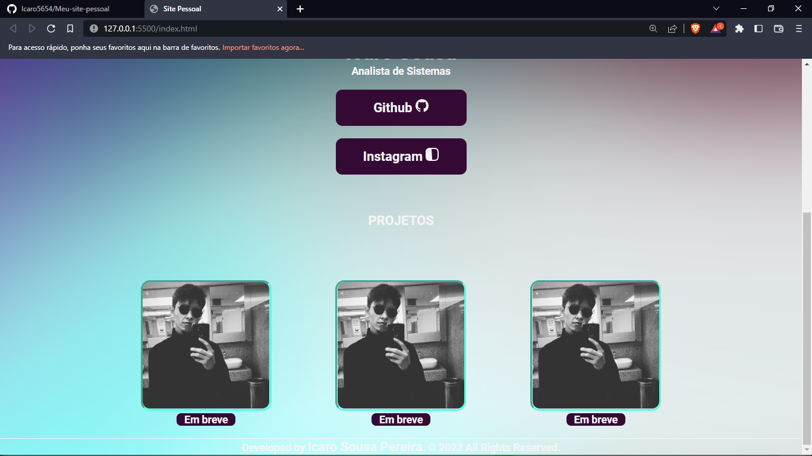

<h1 align="center"> SITE PESSOAL </h1>

​

 

​

<h2 align="center">WEB:</h2>

​

  

​

 

  

 

​

## 🚀 Tecnologias
Esse projeto foi desenvolvido com as seguintes tecnologias:

​
- HTML e CSS

- JavaScript

- Git e Github

​

## 💻 Projeto

Este é um site pessoal meu.
Obviamente prentendo ir atualizando o conteudo.
 
 sendo assim, espero que gostem!

